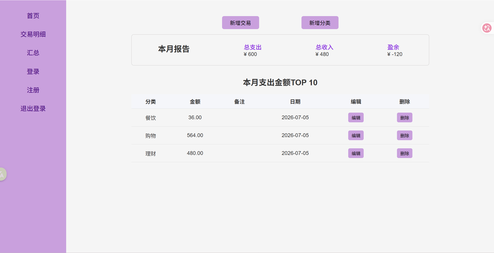
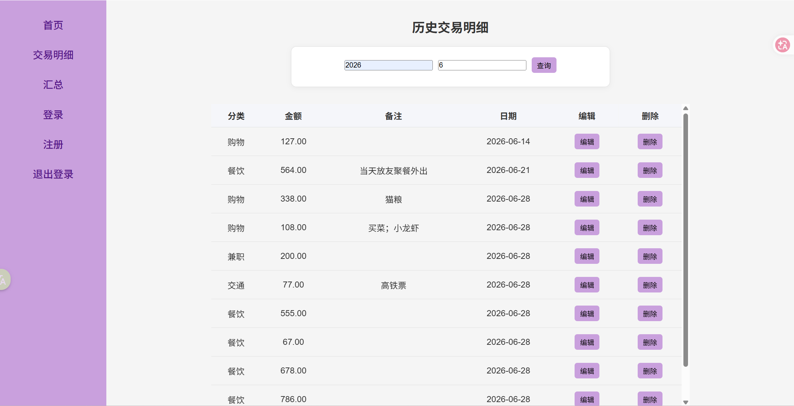

Accounting-System
一款个人记账系统，可以帮助我们跟踪日常的收支情况。用户可以注册并输入自己的日常开销，并对其进行跟踪。用户可以查看自己的开销历史，并根据月份和年份对其进行过滤。




## 功能
- 添加收入或者支出
- 统计当月收支情况（盈余or超支）
- 统计每月top10的支出
- 查询月收支明细


## 开始使用
**环境要求：**
- python 3.9+

**建议使用虚拟环境运行项目，避免依赖冲突**

**安装步骤**
```bash
python -m venv venv 
source venv/bin/activate
pip install -r requirements.txt
```

**运行**
```
python3 run.py
```